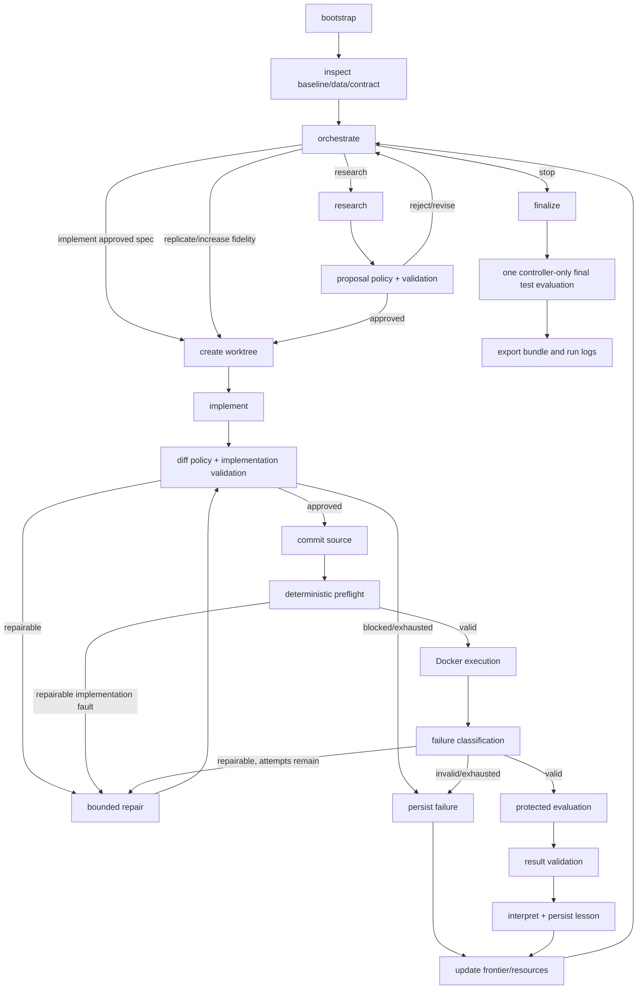

# Autonomous ML Research System Architecture

## 1. Current Repo Assessment

The repository is an uncommitted Python 3.11 project with an empty root README, a placeholder `tiktok2026` package, checked-in KuaiRand-Pure/1K data, and a newly replaced seven-file Starter Kit under `baseline/`. There are no tests, agents, LangGraph code, storage abstractions, runtime directories, Docker configuration, or observability integrations.

The Starter Kit is useful as a canonical benchmark reference but is not a production research harness. It uses cwd-dependent imports, loads all rows into memory, retains the best FM state only in memory, evaluates test data during normal training, writes no metrics/checkpoints, and has no test-label boundary. It defines `long_view`, fixed temporal splits, row-ordered submissions, and GAUC/nDCG@5. The judging document instead makes NDCG@10 and Recall@50 authoritative. The architecture therefore preserves and hashes the Starter Kit while exposing its evaluator only as a provisional diagnostic. An organizer-compatible evaluator must replace the provisional adapter before final judging.

The current `pyproject.toml` includes research dependencies but no LangGraph, API, persistence, testing, lint, or typing dependencies. The baseline itself needs only NumPy. The root data directories conflict with the desired worktree and artifact lifecycle; future runtime data must be external and represented by read-only manifests.

## 2. Architectural Principles

1. LLM agents make judgments; deterministic software owns authority and truth.
2. Capability boundaries are enforced by constructed tool sets and filesystem/process policy, not prompts alone.
3. Domain contracts are typed, versioned, compact, and independent of infrastructure.
4. LangGraph owns resumable workflow transitions, not scientific history or artifacts.
5. Every evaluated source state has a Git commit, parent experiment, dataset manifest, image digest, and artifact hashes.
6. Invalid execution and valid scientific non-improvement are separate terminal facts.
7. Validation is adversarial and independent from implementation.
8. External evidence proposes mechanisms; only local validation supports task-specific conclusions.
9. Search policy is replaceable and starts as a bounded diversity-aware frontier, not full MCTS.
10. The first production milestone is two consecutive autonomous cycles, not generalized distributed infrastructure.

## 3. Key Decisions and Tradeoffs

| Question | Recommendation | Reason |
|---|---|---|
| Baseline ownership | Retain and hash `baseline/` as protected reference code | Preserves organizer provenance and prevents experiment drift. |
| Editable target | Copy model, feature, and training concepts into `src/tiktok2026/experiment/` | Enables clean experiments without mutating canonical benchmark semantics. |
| Evaluator | Protected adapter protocol with provisional NDCG@10/Recall@50 implementation | Judging overrides the conflicting Starter Kit; official code can replace one adapter. |
| Test access | Agents never receive test labels; controller evaluates once after convergence | Prevents test-guided search while preserving the selected final check. |
| Runtime isolation | Pinned project CUDA Docker image, CPU-capable | Supports current NumPy and future GPU models under one execution contract. |
| Worktrees | Configurable sibling runtime root | Avoids recursive worktrees and accidental runtime commits. |
| Data | External read-only datasets plus manifests and hashes | Reduces Git/worktree duplication and establishes provenance. |
| Database | Separate SQLite application and LangGraph checkpoint files | Separates scientific truth/retention from workflow recovery. |
| SQLite access | `sqlite3`, explicit repositories, numbered SQL migrations | Transparent and sufficient for hundreds of experiments. |
| MLflow | Local file-backed by default | Stores telemetry and model artifacts without defining scientific schema. |
| Agents | Four role-specific OpenAI-compatible clients behind protocols | Preserves decomposition and enables fake clients and model replacement. |
| Prompts | Stored beside each agent implementation | Ownership, review, hashing, and role-specific evolution stay clear. |
| Graph | Async LangGraph with small reference-only state | Supports API streaming and cancellation without introducing another orchestrator. |
| Operator surface | Typer CLI and localhost FastAPI control API with SSE | CLI supports reproducibility; API supports an external React demonstration. |
| UI | No frontend in this repository | The external React repository consumes versioned REST and SSE contracts. |
| Human gates | Autonomous within deterministic policies | Maximizes autonomy while all exceptions remain audited interventions. |
| Repair | At most two repairs per `ExperimentSpec` | Recovers normal faults without unbounded token/compute loops. |
| Fidelity | Smoke, proxy, full | Makes cheap evidence and final-eligible runs explicit. |
| Champion ranking | Mean validation NDCG@10 and Recall@50 | Matches equal-weight judging; store raw metrics and deltas separately. |
| Convergence | Improvement at most 0.002 for three consecutive experiments | Uses published experiment-level rule, distinct from trainer early stopping. |
| Search | Champion, two diverse alternatives, one diagnostic/repair slot | Preserves branching without premature MCTS. |
| Duplicates | Hard-block exact normalized signatures; warn on semantic similarity | Deterministic truth remains distinct from uncertain model judgment. |
| Literature | Semantic Scholar, arXiv, and web; cache licensed open full text | Enables evidence retrieval with license and provenance records. |
| External assets | Forbid external training data and pretrained weights | Avoids authorization, fairness, and hidden provenance risk. |
| Traces | Full prompts/responses in restricted runtime artifacts | Maximizes auditability; SQLite stores hashes, usage, and references. |
| Run logs | Deterministically export Markdown and JSONL | Supports both judging readability and machine audit. |

## 4. Recommended Repository Tree

```text
.
├── AGENTS.md
├── README.md
├── pyproject.toml
├── baseline/                         # protected Starter Kit reference
├── config/
│   └── budgets/{test,development,judged}.toml
├── docker/Dockerfile
├── docs/ARCHITECTURE.md
├── migrations/
│   ├── application/001_initial.sql
│   └── graph/001_initial.sql
├── src/tiktok2026/
│   ├── __init__.py
│   ├── __main__.py
│   ├── bootstrap.py                  # composition root only
│   ├── agents/
│   │   ├── orchestration/            # client, context builder, prompt
│   │   ├── research/                 # client, context builder, prompt
│   │   ├── implementor/              # restricted coding capabilities
│   │   └── validator/                # proposal/patch/result review
│   ├── api/                          # FastAPI REST and SSE adapter
│   ├── benchmark/
│   │   └── kuaireand_pure/           # manifest and protected adapters
│   ├── contracts/                    # Pydantic domain and port schemas
│   ├── evaluation/                   # protected evaluator gateway/registry
│   ├── execution/                    # Docker process and resource control
│   ├── experiment/                   # editable model/features/training target
│   ├── graph/                        # state, nodes, routes, graph assembly
│   ├── literature/                   # retrieval, license, MethodCard creation
│   ├── memory/                       # retrieval and lesson compression
│   ├── observability/                # logs, traces, MLflow, audit exporters
│   ├── persistence/                  # sqlite3 repositories and migrations
│   ├── policies/                     # pure authorization/budget/convergence
│   ├── repository/                   # inspection, patch, Git/worktrees
│   ├── search/                       # bounded frontier and duplicate signatures
│   └── testing/                      # fakes and synthetic lifecycle
└── tests/
    ├── architecture/
    ├── contracts/
    └── integration/
```

No scoped `AGENTS.md` is needed in orchestration or research yet because root dependency rules and typed permissions fully describe them. Implementor, Validator, Evaluation, and Execution receive scoped files because their write/authority rules materially differ.

## 5. Responsibility of Each Major Module

| Module | Owns | Must not own | Public boundary |
|---|---|---|---|
| `contracts` | IDs, enums, agent I/O, lifecycle results, capability protocols | SQL, SDK clients, filesystem, framework state | Pydantic models and `Protocol`s |
| `agents` | Prompted judgment and structured-output validation | Authority, policy exceptions, direct privileged integrations | One typed async call per role/stage |
| `graph` | Node sequencing, compact state, conditional routing | Raw history, SQL, shell, Git, metric computation | Compiled LangGraph and state schema |
| `policies` | Pure checks for budgets, protected paths, retries, convergence, finalization | Side effects or LLM judgment | Pure decisions with reason codes |
| `repository` | Read maps, assigned worktree edits, diff capture, commits, cleanup | Scientific selection or evaluation | Narrow capability and manager protocols |
| `execution` | Docker command execution, limits, cancellation, telemetry | Experiment interpretation | `Executor.execute(request)` |
| `evaluation` | Prediction validation, evaluator invocation, parsing, provenance | Training, graph routing, interpretation | `Evaluator.evaluate(request)` |
| `benchmark` | Data/split/submission manifests and organizer adapters | Search strategy or model code | `BenchmarkAdapter` |
| `experiment` | Editable features, models, trainer, checkpoint bundle | Benchmark authority, persistence, orchestration | Container command and artifact contract |
| `persistence` | Transactions, records, migrations, audit events | Context selection or agent calls | Repository protocols |
| `memory` | Retrieval/ranking and compressed lessons | Canonical experiment truth or raw artifacts | Context query and lesson writer |
| `search` | Frontier ranking/diversity and duplicate signatures | Graph transitions or process scheduling | Frontier policy functions |
| `literature` | Queries, source provenance, license checks, MethodCards | Unauthorized assets or scientific truth | Retrieval capability |
| `observability` | Structured logs, trace artifacts, MLflow telemetry, exports | Canonical decisions | Sink protocols and report exporters |
| `api` | Local control/read endpoints and SSE projections | Direct database or privileged process mutation | Versioned HTTP API |
| `bootstrap` | Configuration loading and dependency construction | Domain logic | CLI/API application factories |

## 6. Dependency Rules

```text
                 contracts
                 /   |   \
          pure policies  capability protocols
             /      |       \
        search    agents    graph node logic
           \        |        /
            deterministic controller
         /      /      |       \       \
 repository execution evaluation persistence observability
                  \      |      /
                 bootstrap composition
```

- Contracts import only Pydantic, standard-library types, and other contracts.
- Pure policies may import contracts; they perform no I/O.
- Agents import contracts and injected capability protocols, never concrete MLflow, SQLite, Docker, Git, or evaluator code.
- Graph nodes call controller use cases, never SQL or shell directly.
- Evaluation and memory never depend on agents or LangGraph.
- Persistence never depends on agents, graph, evaluation, or MLflow.
- Implementor logic cannot invoke Docker. It may run a small allowlisted check capability; the controller owns actual execution.
- Orchestration policy is evaluated in two steps: the agent proposes a typed decision, then deterministic policy validates and maps it to an allowed route.
- `bootstrap.py` is the only place allowed to connect concrete privileged implementations to graph nodes and API handlers.

## 7. LangGraph Design

### Graph state

Checkpoint only compact recovery data:

```text
run_id
phase
current_experiment_id
current_hypothesis_id
active_worktree_id
latest_validation_report_id
latest_execution_result_id
latest_evaluation_result_id
orchestration_decision_id
repair_attempts
fidelity
pending_route
terminal_reason
state_version
```

Store only IDs for specs, diffs, logs, prompts, reports, artifacts, checkpoints, literature, and history. SQLite is canonical; graph checkpoints permit resumption and may be rebuilt from durable records.

### Nodes and routes



Conditional edges live in `graph/routes.py` and accept deterministic route enums only. Agent prose cannot name arbitrary nodes. Failures first become typed `FailureRecord`s; classifier policy determines repair, retry, requeue, or terminal persistence. Repairs retain the same experiment and hypothesis IDs. Scientific redesign requires a new `ExperimentSpec`.

## 8. Four Agent Interfaces

### Orchestration Agent

- Inputs: frontier summaries, champion, recent lessons, unresolved failures, validation reports, convergence status, resource state, allowed actions.
- Output: `OrchestrationDecision` with action, target IDs, rationale evidence IDs, requested fidelity, and stop rationale.
- Tools: read-only experiment/frontier/memory/resource queries.
- Prohibited: shell, repository write, metric calculation, SQL mutation, policy override.
- Prompt: `agents/orchestration/prompt.md`.
- Tests: fake structured responses, unsupported routes, exhausted budgets, convergence, diversity decisions, one schema-repair attempt.

### Research Agent

- Inputs: typed repository/data observations, retrieved lessons, experiment lineage, benchmark contract, budget envelope, literature records.
- Output: `ResearchDecision`, `Hypothesis`, `ExperimentSpec`, interpretation, or explicit evidence request.
- Tools: repository map/search/read, safe data summaries, memory query, Semantic Scholar/arXiv/web retrieval.
- Prohibited: source write, shell, test labels, external assets, evaluator mutation.
- Prompt: `agents/research/prompt.md`.
- Tests: leakage scenarios, historical duplicate context, unsupported evidence, structured specs, no recipe catalog.

### Implementor Agent

- Inputs: approved spec, editable-scope manifest, repository map, parent commit, allowed checks, relevant source excerpts.
- Output: `ImplementationResult` with patch/artifact reference, changed files/symbols, checks, assumptions, unresolved issues.
- Tools: scoped worktree read/search/write/diff and allowlisted static/smoke checks.
- Prohibited: experiment selection, hypothesis drift, protected files, commit, Docker, evaluation, persistence.
- Prompt: `agents/implementor/prompt.md`.
- Tests: protected path attempts, unrelated edits, underspecified/impossible specs, faithful patch fixtures.

### Validator Agent

- Inputs: stage-specific subject, exact spec, diff/provenance, historical duplicates, benchmark contract, deterministic policy evidence, result artifacts.
- Output: `ValidationReport` with stage, verdict, blockers, warnings, evidence IDs, leakage/fidelity/confidence fields.
- Tools: read-only repository/diff/data summaries/history/evaluator results.
- Prohibited: source changes, repair, execution, evaluator invocation, policy exception.
- Prompt: `agents/validator/prompt.md`.
- Tests: proposal duplication, leakage, spec drift, protected changes, wrong parent, invalid evaluator, noisy result.

All agents use role-specific configured OpenAI-compatible models. Structured outputs receive one schema-repair call; a second failure becomes an agent failure record.

## 9. Deterministic Service Interfaces

Use protocols and functions at privilege seams, not a class per function:

- `RepositoryInspector`: repository map, symbol/search/read observations.
- `WorktreeManager`: create sibling worktree, verify assignment, remove/recover.
- `PatchPolicy`: normalize diff, enforce scope/protected hashes, compute signature.
- `SourceRegistrar`: commit validated source and record parent/source identity.
- `DockerExecutor`: execute typed commands with mounts/limits and cancellation.
- `ResourceLedger`: atomic reserve, consume, release, and final reserve enforcement.
- `FailureClassifier`: evidence-to-enum mapping before optional validator judgment.
- `BenchmarkAdapter`: manifests, split views, prediction identity, submission writer.
- `EvaluatorRegistry`: provisional and official evaluator resolution by immutable identity.
- `CheckpointRegistry`: bundle validation, hashes, source/config/vocabulary linkage.
- `ExperimentRepository`: canonical specs, lineage, outcomes, lessons, audit records.
- `DuplicateDetector`: exact normalized spec/diff block and semantic evidence warning.
- `FrontierPolicy`: bounded best-first/diversity ranking over persisted candidates.
- `ConvergencePolicy`: metric history and budget terminal decision.
- `MemoryRetriever`: bounded relevant records and lessons for an agent context.
- `LiteratureRetriever`: source-specific retrieval, license/provenance, cache.
- `TraceSink`: model/tool usage, restricted trace artifacts, correlation IDs.
- `RunLogExporter`: deterministic Markdown and JSONL judging outputs.

## 10. Data / Memory / Artifact Architecture

| Store | Contents |
|---|---|
| LangGraph SQLite | Compact checkpoints, route recovery, pending node state |
| Application SQLite | Hypotheses, specs, lineage, decisions, reports, failures, lessons, duplicate signatures, resource ledger, interventions, artifact metadata |
| Git | Canonical source, experiment commits, diffs, branch lineage, protected reference files |
| MLflow | Run params, curves, system telemetry, metric series, checkpoint references |
| Artifact filesystem | Checkpoint bundles, predictions, evaluator output, logs, traces, patches, licensed papers, exports |
| Dataset root | Read-only raw data, outside worktrees, verified by manifest |

Memory retrieval returns bounded structured facts, lineage neighbors, relevant lessons, and artifact references. Raw logs and full traces stay outside model context. Lessons are explicit claims with evidence strength, scope, affected modules/tags, and supporting experiment IDs.

A final checkpoint bundle contains model state, model/config schema versions, fitted feature/vocabulary state, source commit, parent experiment, dataset manifest, validation metrics, prediction CSV, environment/image identity, and hashes.

## 11. Experiment Lifecycle

An experiment begins as a hypothesis-backed immutable spec. Deterministic proposal checks and Validator review gate worktree creation. The Implementor changes only the editable target. Deterministic diff policy and Validator review precede a controller-created commit. Smoke, proxy, and full executions use the same request schema and differ only by approved fidelity configuration.

Execution failures become classified records. Syntax/import/schema faults may enter at most two same-experiment repairs. Environment and resource failures may retry or requeue under policy. Valid worse results are persisted as scientific negatives and interpreted against the correct parent. Frontier and convergence updates occur only after persistence.

At convergence or budget exhaustion, the validation-best checkpoint is frozen. The controller performs the single non-routing test evaluation, creates the submission, and exports provenance, resource use, interventions, and Markdown/JSONL iteration logs.

## 12. Testing Strategy

1. Contract tests: serialization, versioning, enum coverage, validation invariants.
2. Pure policy tests: routes, budgets, retries, convergence, protected paths, test isolation.
3. Persistence tests: migrations, transactions, crash replay, idempotency, lineage.
4. Adapter tests: Git lifecycle, Docker requests, evaluator parsing, MLflow references.
5. Failure injection: malformed agent output, syntax failure, timeout, OOM evidence, missing artifact, invalid predictions.
6. Graph tests: every allowed route and terminal path with fake agents/services.
7. Architecture tests: forbidden imports and protected reference hashes.
8. End-to-end fake: fake researcher, synthetic `ExperimentSpec`, fake implementor patch, tiny CPU trainer process, provisional fixture evaluator, persistence, lesson, and next orchestration decision.

The synthetic lifecycle uses no network, LLM, Docker, GPU, or KuaiRand data. Docker integration tests are separate and opt-in. Agent tests assert schema and evidence handling, not exact prose.

## 13. Runtime Storage Strategy

Default sibling root: `../TikTok2026.runtime/`, configurable by `TIKTOK2026_RUNTIME_ROOT`.

```text
TikTok2026.runtime/
├── application.sqlite3
├── graph.sqlite3
├── locks/
├── worktrees/<experiment-id>/
├── artifacts/<run-id>/<experiment-id>/
│   ├── patches/
│   ├── execution/
│   ├── evaluation/
│   ├── checkpoints/
│   └── predictions/
├── traces/<run-id>/
├── literature/<source-id>/
├── mlflow/
├── exports/<run-id>/{iterations.jsonl,iterations.md,summary.md}
└── tmp/
```

Create artifacts through atomic temporary paths followed by rename; hash before registration. Per-experiment locks protect worktrees and execution. Startup recovery reconciles locks, Docker processes, pending checkpoints, and artifact records. Cleanup is policy-driven and never deletes champion/final/provenance artifacts. Disk reservations are enforced before execution.

## 14. Configuration / Secrets Strategy

Use Pydantic settings loaded in this order: committed TOML profile, optional operator TOML outside Git, environment variables, CLI overrides. Reject unknown keys and invalid judged profiles. Configuration covers role-specific model endpoint/name/temperature/token cap/timeout; runtime/data/baseline paths; Docker image digest; fidelity commands and limits; GPU/token/wall/disk budgets; final reserve; SQLite files; MLflow URI; logging; API bind/CORS; literature sources; and evaluator identity.

API keys and provider credentials come only from environment variables or mounted secret files. The local API binds loopback. All state-changing endpoints create actor-tagged audit events. The chosen localhost-only v1 API has no authentication, so remote binding must be rejected unless authentication is added.

## 15. Observability Strategy

- Structured application logs: operational debugging, correlation IDs, no canonical scientific claims.
- SQLite audit/scientific records: decisions, lineage, failures, lessons, interventions, provenance.
- MLflow: metric curves, parameters, system/GPU telemetry, artifact references.
- Restricted trace artifacts: full prompts, responses, tool calls, token details, context hashes.
- Git/artifacts: source diffs, commits, checkpoints, prediction/evaluator outputs.
- SSE projection: lifecycle, metrics, budgets, lineage, failures, interventions for the external React UI.
- Judging exports: per-iteration hypothesis, diff, NDCG@10/Recall@50, errors/recovery, intervention count, total tokens, and GPU-hours.

Every event carries run ID; experiment ID where applicable; causation/correlation IDs; timestamp; actor; source commit; and schema version. Avoid copying full traces into SQLite or MLflow.

## 16. `AGENTS.md` Hierarchy

- `/AGENTS.md`: repository purpose, invariants, dependency direction, protected benchmark, tests, runtime policy, definition of done.
- `/src/tiktok2026/agents/implementor/AGENTS.md`: strict source-write scope and hypothesis-fidelity rules.
- `/src/tiktok2026/agents/validator/AGENTS.md`: read-only adversarial stage review.
- `/src/tiktok2026/evaluation/AGENTS.md`: metric authority, provisional conflict, test isolation, provenance.
- `/src/tiktok2026/execution/AGENTS.md`: Docker/process/resource authority.

The complete usable contents are committed at those paths. Scoped files for Research and Orchestration are deferred because their local constraints do not yet materially exceed the root instructions.

## 17. Complete `AGENTS.md` Contents

The files listed in Section 16 are the canonical complete drafts. Keeping them as actual files avoids documentation drift and lets coding agents consume scoped instructions directly.

## 18. Implementation / Migration Plan

1. Freeze contracts, benchmark manifest, protected hashes, metric provisionality, test isolation, and failure taxonomy.
2. Build SQL migration runner, repositories, audit event model, artifact registry, and resource ledger.
3. Build synthetic fake lifecycle through async graph routes and verify two consecutive cycles.
4. Extract editable Starter Kit model/features/training into `experiment/`; add reproducibility and checkpoint bundle tests.
5. Implement Git sibling worktrees, protected diff policy, source commits, and crash recovery.
6. Implement Docker executor, fidelity profiles, telemetry, timeout/process cleanup, and no-network/read-only mounts.
7. Integrate provisional judging evaluator and Starter Kit diagnostic adapter; replace provisional code when organizer evaluator arrives.
8. Add role-specific OpenAI-compatible clients, prompt/context builders, structured output repair, and restricted traces.
9. Add SQLite memory retrieval, exact duplicates, semantic warnings, and four-slot frontier.
10. Add Typer commands, FastAPI REST/SSE control plane, and deterministic judging exports.
11. Run two autonomous KuaiRand-Pure cycles, then harden failure recovery and convergence/finalization.

Contracts, protected manifests, audit identity, failure categories, and artifact provenance should freeze early. Model provider, prompt text, retrieval ranking, MLflow deployment, search scoring, and API projections are intentionally replaceable.

## 19. Deferred Features

- KuaiRand-1K and KuaiRand-27K bonus adapters
- Full MCTS/MCGS
- Multiple simultaneous GPU runs
- Remote API authentication and multi-user tenancy
- Distributed scheduling, Kubernetes, and workers
- Vector or graph databases
- Automated paper writing
- Autonomous external data/pretrained weights
- General-purpose plugin platform
- Frontend code

## 20. Risks / Open Questions

| Risk or open question | Recommended default |
|---|---|
| Judging evaluator implementation is missing | Keep all NDCG@10/Recall@50 results explicitly provisional until organizer code is integrated. |
| Starter Kit contradicts judging metrics | Preserve it as hashed diagnostic reference; never use its primary score for final selection. |
| Exact Recall@50 candidate/denominator semantics are unspecified | Use standard within-user binary recall provisionally and version evaluator identity. |
| Local test labels are present | Enforce access through controller capabilities, not path secrecy; audit the single final use. |
| Docker image is not yet digest-pinned | Pin digest after first verified build and record it in every execution. |
| Judged resource limits are unknown | Reject zero/unset judged budget profile at startup. |
| Existing datasets are checked into the working tree | Migrate to external data root and keep only manifests before creating many worktrees. |
| Localhost API has no authentication | Reject non-loopback binding; add auth before any remote demo. |
| Full paper caching has license risk | Cache full text only with machine-recorded open license; otherwise retain metadata/excerpts. |
| No initial Git commit exists | Establish a canonical base commit before any worktree experiment lifecycle. |

### Proposed architectural invariants

1. Deterministic code owns identity, policy, execution, evaluation, persistence, and budgets.
2. Exactly four permanent LLM roles exist.
3. Agents communicate authoritative information through typed contracts.
4. Agents never receive unrestricted shell, Git, database, Docker, or evaluator authority.
5. Protected Starter Kit files remain hash-verified and unchanged.
6. NDCG@10 and Recall@50 are authoritative; provisional evaluators are labeled non-official.
7. Test labels never enter agent context or graph routing.
8. Every evaluated source state is a validated pre-execution Git commit.
9. Runtime state, worktrees, datasets, traces, and artifacts stay outside the repository.
10. LangGraph state contains references and bounded recovery context, not histories or artifacts.
11. Invalid runs do not become scientific evidence.
12. Repairs retain experiment identity and are bounded to two attempts.
13. Exact duplicates are blocked; semantic similarity is review evidence.
14. External training data and pretrained weights are forbidden.
15. Every decision, intervention, resource use, patch, metric, and artifact is reconstructable.

### First five implementation tasks

1. Implement and test versioned domain contracts plus failure, fidelity, decision, and validation enums.
2. Implement checksummed SQLite migration runners, repositories, audit events, and artifact records.
3. Implement the deterministic synthetic two-cycle lifecycle with fake four-agent outputs and graph routing.
4. Implement benchmark manifest verification, protected-path policy, provisional evaluator, and hidden-test guard.
5. Implement sibling worktree creation, scoped Implementor edits, diff validation, and pre-execution source commits.
